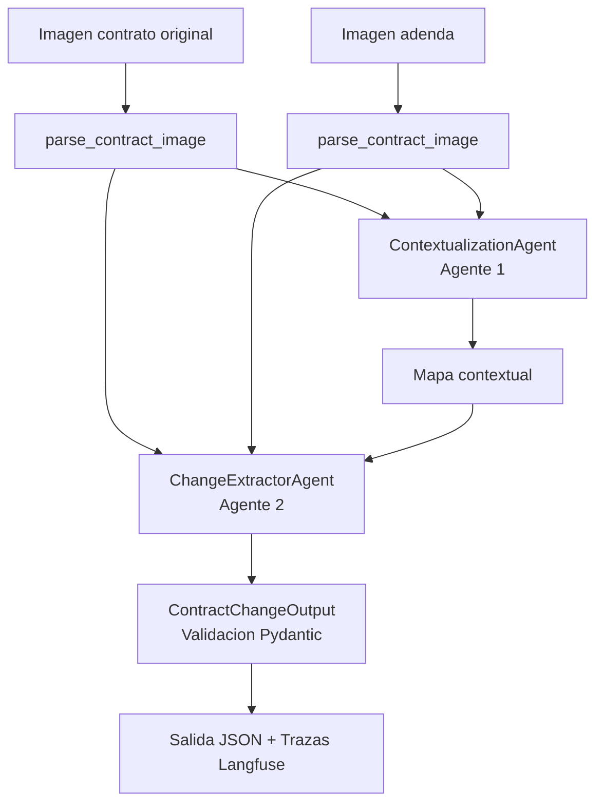

# 🤖 Sistema de Análisis de Contratos con Agentes IA

Una aplicación Python de **dos agentes de IA** que leen, contextualizan, extraen y comparan contratos usando OpenAI Vision (GPT-4o), con trazas completas en Langfuse y validación estructurada con Pydantic.

## ✨ Características Principales

- **🤖 Dos Agentes Especializados** en pipeline secuencial:
  - **Agente 1 (Contextualizador)**: Mapea estructura comparada e identifica correspondencias
  - **Agente 2 (Extractor de Cambios)**: Identifica, aísla y clasifica cambios con validación Pydantic
  
- **📊 Trazas Completas en Langfuse**: Monitoreo automático de cada llamada a GPT-4o
- **✅ Validación Estructurada**: Modelos Pydantic para garantizar calidad de datos
- **🖼️ Soporte Multi-formato**: JPG, PNG, GIF, WebP
- **⚙️ Configuración Flexible**: Prompts personalizables por agente
- **📦 Modular y Extensible**: Arquitectura lista para agregar más agentes (Reportes, Análisis Adicional, etc.)

## 🚀 Inicio Rápido

### 1. Instalación

```bash
# Clonar el proyecto
git clone https://github.com/shinax/tp4-ai-eng-pt3.git

# Instalar dependencias
pip install -r requirements.txt
```

### 2. Configuración

Asegúrate de que el archivo `.env` contenga las variables necesarias, hay un ejemplo en .env.example

### 3. Ejecución

```bash
# Opción 1: Prueba rápida con imágenes ya cargadas en el código
python main.py

# Opción 2: Con contratos reales
python main.py -original_path="./examples/documento_1__original.jpg" -amendment_path="./examples/documento_1__enmienda.jpg"

# Opción 3: Agregando prompts personalizados
python main.py --original_path="./examples/documento_1__original.jpg" --amendment_path="./examples/documento_1__enmienda.jpg" --change_extractor_prompt="Devolveme una instancia simple y válida de la clase ContractChangeOutput, en idioma francés" --contextualizer_prompt="Devolveme el string 'batman rules'" --image_parser_prompt="Devolveme un string de 10 caracteres"
```

## 📚 Estructura del Proyecto

```
├── main.py                    # Aplicación principal
├── agents.py                  # Clases de agentes
├── config.py                  # Configuración centralizada
├── utils.py                   # Utilidades y formateadores
├── requirements.txt           # Dependencias
└── .env                       # Variables de entorno
```

## Arquitectura de Agentes

El siguiente diagrama refleja el flujo real implementado actualmente en el proyecto:




## 📊 Monitoreo en Langfuse

Después de ejecutar, accede a tu dashboard en https://cloud.langfuse.com para ver:

- **Timeline**: Duración de cada generación de IA
- **Inputs/Outputs**: Prompts y respuestas completamente
- **Metadata**: Información contextual (rutas de imágenes, etc.)
- **Tokens**: Consumo de tokens por llamada
- **Errores**: Stack traces si algo falla


## 🎯 Mejores Prácticas Implementadas

### ✅ Modularización
- Cada agente es una clase independiente
- Fácil de reutilizar y extender
- Responsabilidades bien definidas

### ✅ Trazas Completas
- Cada operación genera una traza en Langfuse
- Seguimiento completo del flujo
- Observabilidad de todas las llamadas a GPT-4o

### ✅ Validación Estructurada
- Modelos Pydantic para garantizar calidad
- Validación de salidas de IA
- Manejo de errores de validación

### ✅ Manejo Robusto de Errores
- Validación de imágenes
- Checks de status
- Mensajes descriptivos y accionables

### ✅ Configuración Flexible
- Variables de entorno centralizadas
- Prompts personalizables por agente
- Fácil de adaptar a nuevos casos de uso

### ✅ Codificación Segura
- Base64 para transmisión de imágenes
- Detección automática de MIME types
- Soporte multi-formato (JPG, PNG, GIF, WebP)


## ✨ Detalles
- En un momento me olvidé de pasarle los resultados de los parseos de las imágenes al ContextualizationAgent y devolvía un análisis totalmente convicente, más allá de ser totalmente inventado. Sigo sin saber qué estaba comparando realmente.
- En consecuencia, me gustaría agregar algo que valide si la enmienda parece no corresponderse con el original. Lo agregaría como metadata, no frenaría el proceso.
- Sigo teniendo algunos problemas con poder usar langfuse correctamente, nunca me llevé bien con contextos y decoradores. En un momento saqué los spans porque claramente los había implementado mal y aparecía mucha repetición en langfuse.
- Agregar un `sys.excepthook` que haga .flush()
- Recomiendo fuertemente probar el caso de ejemplo #3, para probar prompts personalizados.